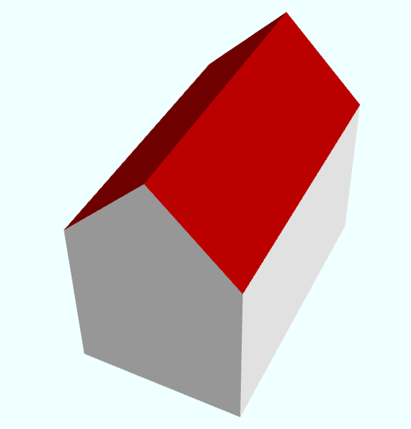
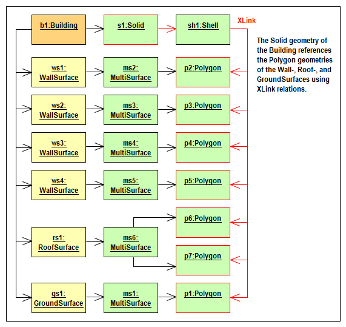
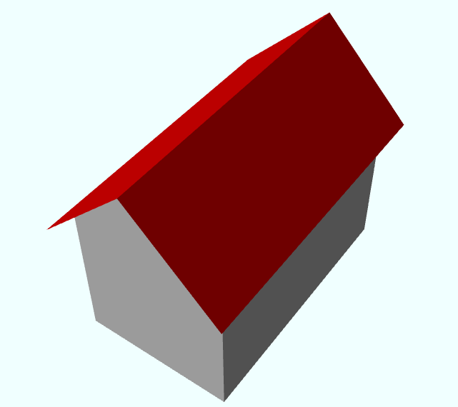
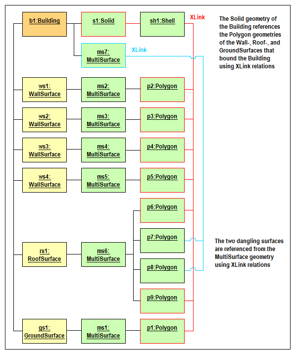
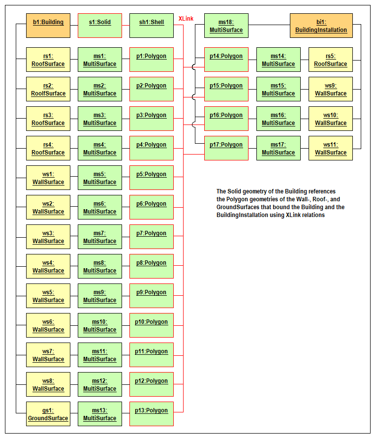
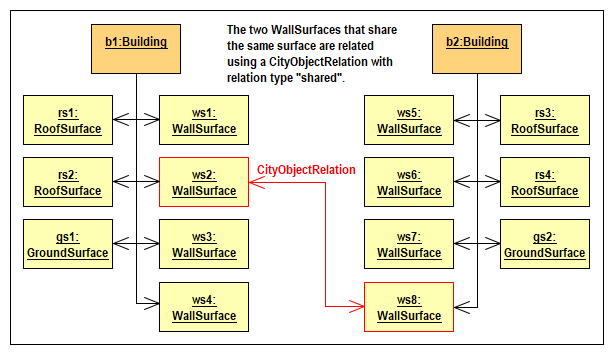
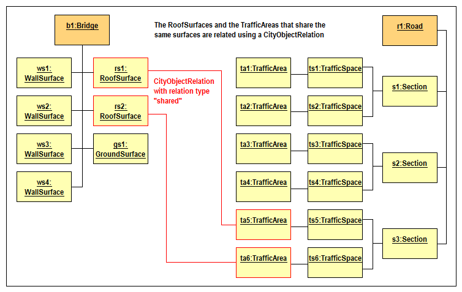
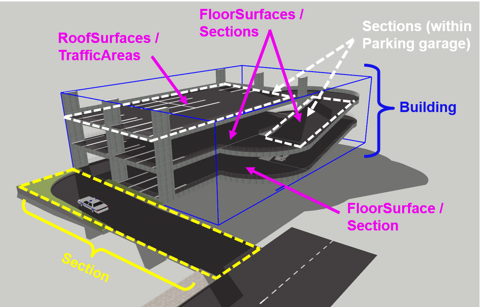
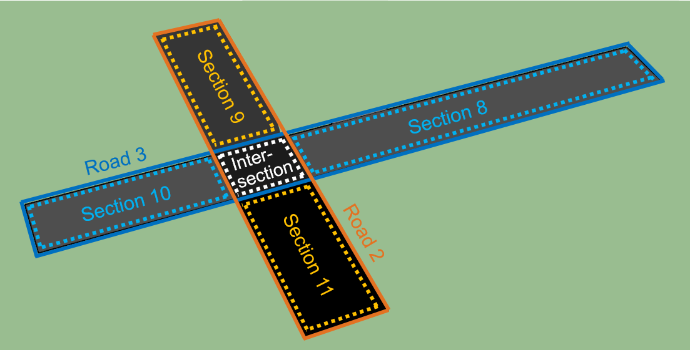
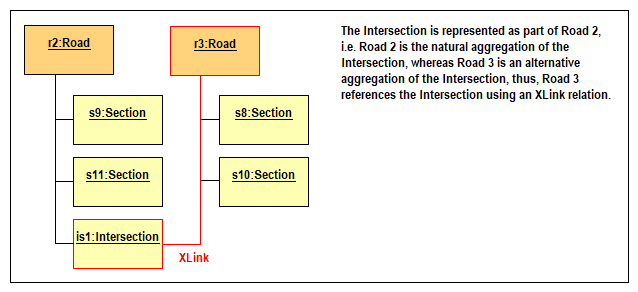

[[global-section]]
=== Global Requirements

This chapter defines general requirements which are valid for all Conformance Classes and cannot be derived from the GML schemas.

[[gml-section]]
==== Use of GML 3.2.1

The CityGML 3.0 GML schemas have been derived based on the OGC GML 3.2.1 standard. This means that CityGML GML instance documents must be created and exchanged in the GML version 3.2.1.

NOTE: Add requirement in tabular form

If for certain reasons the use of GML 3.3 is preferred, <<annex-gml-3.3>> provides an example for how to make use of GML 3.3 in CityGML instance documents. Please note, however, that software compliant to this standard might not be able to read the additional GML 3.3 content.

[[object-identifier-section]]
==== Object identifiers for features and geometries

In the GML encoding of the CityGML 3.0 Conceptual Model, different types of objects exist: _features_, _top-level features_, and _geometries_. All these objects have a unique identity, thus, they can be distinguished from each other and can also be referenced from other objects.

The CityGML 3.0 Conceptual Model introduces two attributes to provide all features and top-level features with a unique identity: 1) the mandatory _featureID_ attribute to distinguish all (top-level) features and possible multiple versions of the same real-world object and 2) an optional _identifier_ attribute to reference specific (top-level) features independent from their actual feature version. The featureID attribute value is unique within the same CityGML dataset and also for a specific version of a feature, whereas the identifier attribute has an identical value for all versions of the same real-world object. It is recommended to use globally unique identifiers like UUID values or identifiers maintained by an organization such as a mapping agency for both attributes: for the identifier attribute, as these identifiers should remain stable over the lifetime of the real-world object, and for the featureID attribute, as this ensures that 3D city models which are integrated from different sources into e.g. one GIS or database will not have colliding featureID values and also to be able to uniquely identify a specific version of a feature using these identifiers together with a timestamp and a version number.

The two attributes are defined in the UML class _AbstractFeature_ as part of the Core module of the CityGML 3.0 Conceptual Model. They are mapped to the predefined GML concepts _gml:id_ and _gml:identifier_ in the GML encoding. <<table-gml-identifiers>> lists the two identity attributes together with their definition and GML encoding, and the GML code in <<listing-gml-identifiers>> illustrates the use of the identity attributes to represent the object identity in GML instance documents. Please note that, although the _featureID_ attribute is defined mandatory in the CityGML 3.0 Conceptual Model, the _gml:id_ attribute is optional according to the GML standard.

[[table-gml-identifiers]]
.Identity attributes used in CityGML 3.
[cols="25,30,45",options="headers"]
|===
^|*UML attributes to provide (top-level) features with identity* ^|*Mapping to corresponding GML concepts* ^|*Definition*
|featureID
|XML attribute gml:id
|Specifies the unique identifier of the feature that is valid in the instance document within which it occurs.
|identifier
|XML element gml:identifier
|Specifies the unique identifier of the feature that is valid globally.
|===

//[[figure-gml-identifiers]]
//.Use of the identity attributes in CityGML 3 instance documents.
//image::images/GML_Identifiers.png[align="center"]

[[listing-gml-identifiers]]
.Use of the identity attributes in CityGML 3 instance documents.
[source,XML,highlight='1,2']
----
<bldg:Building gml:id="B1020">
  <gml:identifier codeSpace="www.xyz.org">B1020</gml:identifier>
  <core:creationDate>2012-08-02T00:00:00</core:creationDate>
  <core:terminationDate>2013-10-09T00:00:00</core:terminationDate>
  <bldg:function>Office</bldg:function>
</bldg:Building>
----

The GML encoding implements the geometry model defined in ISO 19107. This means that all geometries are derived from the class AbstractGML as well and, thus, also geometries exhibit the same unique identity as features do. The fact that geometries also have an identity is of particular importance for CityGML, since CityGML requires defining references to geometries. For these references, only the gml:id attribute is of interest. One example is the application of textures to surfaces. The textures reference the gml:ids of those LinearRings that describe the boundaries of the surface geometries (e.g. Triangle, Polygon, or a MultiSurface consisting of Polygons) to which the textures are applied. Another example is that the CityGML GML encoding allows for realising topological relationships amongst others through referencing of shared geometries.

[[referencing-features-section]]
==== Referencing features and geometries

There are two XML concepts that are used to reference objects in GML instance documents: the XML Linking Language (XLink) and the XML Pointer Language (XPointer).

XLink allows for creating links (referred to as XLinks in this document) by providing specific attributes to XML elements for referencing other resources. The most commonly used attribute is _xlink:href_, the value of the attribute is the URI of the referenced document. In CityGML, however, we are mainly interested in referencing specific objects (features and geometries) within the same or an external GML instance document. To be able to reference specific objects, XPointer needs to be used in addition to XLink. For references to objects in external documents the URI value provided in the xlink:href attribute is complemented by a number sign (\#) followed by the gml:id of the object to be referenced. For references to objects within the same document it is enough to provide the number sign (#) and the gml:id of the referenced object (this is also called a relative URI). This is exemplified in <<listing-gml-references>>, where the element <versionMember> references a <Building> feature. Since the feature is part of the same GML instance document, a relative URI is specified by simply providing the number sign and the gml:id of the building as value of the attribute xlink:href. In the context of version management, referencing features by their gml:id means that a specific feature version of a real-world object is referenced.

//[[figure-gml-references]]
//.Referencing a feature by its gml:id.
//image::images/GML_Identifiers.png[align="center"]

[[listing-gml-references]]
.Referencing a feature by its gml:id.
[source,XML,highlight='4,8']
----
<core:CityModel gml:id="CM_1">
  <core:versionMember>
    <vers:Version gml:id="V_1">
      <vers:versionMember xlink:href="#BU_234"/>
    </vers:Version>
  </core:versionMember>
  <core:cityObjectMember>
    <bldg:Building gml:id="BU_234"> ... </bldg:Building>
  </core:cityObjectMember>
<core:CityModel>
----

//For referencing the actual real-world object itself, a reference to the <gml:identifier> element of the feature versions needs to be provided. However, this kind of reference can be ambiguous, since all feature versions of a specific real-world object hold the same <gml:identifier> value; thus, a reference to a <gml:identifier> value may refer to multiple features. A possible disambiguation can be performed when selecting only that feature version that is valid for a given time point (and optionally a specific workspace). In the example below, the XPointer references the real-world feature BuildingPart with the ID “BP_12” by referencing all versions of the BuildingPart feature with the corresponding <gml:identifier> value “BP_12”. For selecting a specific BuildingPart version only, the time points <core:creationDate> and <core:terminationDate> need to be evaluated in addition.
//Figure

When using references, it is important to keep in mind that many (top-level) features in CityGML have a complex structure. This is shown in <<listing-gml-complex-structure>>. In general, features can have spatial and non-spatial properties that describe the features in more detail. Spatial properties are properties that have a geometry from ISO 19107 as data type (<lod2Solid> in the example). Non-spatial properties can either have a simple data type (<function> with Integer value or <creationDate> with Date value), but they can also be further specified by additional attributes, such as the height of the building that is described by further properties (<height> with the additional properties <highReference>, <lowReference>, <status>, and <value>). In addition, they can also be composed of subfeatures that contain spatial and non-spatial properties themselves (<WallSurface> with <lod2MultiSurface> geometry).

The subfeatures can be provided _inline_ or _by reference_. Inline means that the subfeatures are provided directly as content of the (top-level) feature as is shown below, where the subfeature <BuildingRoom> is provided as content of the <Building> feature. In contrast, by reference means that the subfeatures are provided elsewhere in the CityGML document and are referenced from the (top-level) feature using an XLink as is described above and illustrated in <<listing-gml-references>>.

[[listing-gml-complex-structure]]
.Complex structure of CityGML features.
[source,XML]
----
<bldg:Building gml:id="BU_234">
  <core:creationDate>2019-09-24T00:00:00</core:creationDate>
  <core:boundary>
    <con:WallSurface gml:id="WS_21">
      <core:lod2MultiSurface>
        <gml:MultiSurface gml:id="MS_21_1">
          ...
        </gml:MultiSurface>
      </core:lod2MultiSurface>
    </con:WallSurface>
  </core:boundary>
  <core:lod2Solid>
    <gml:Solid gml:id="S_1"> ... </gml:Solid>
  </core:lod2Solid>
  <con:height>
    <con:Height>
      <con:highReference>topOfConstruction</con:highReference>
      <con:lowReference>lowestGroundPoint</con:lowReference>
      <con:status>measured</con:status>
      <con:value uom="urn:adv:uom:m">24.709</con:value>
    </con:Height>
  </con:height>
  <bldg:function>1000</bldg:function>
  <bldg:buildingRoom>
    <bldg:BuildingRoom gml:id="BR_3">
      ...
    </bldg:BuildingRoom>
  <bldg:buildingRoom>
</bldg:Building>
----

[[linking-rules-section]]
==== Rules for linking features and geometries that are shared by multiple (top-level) features

When modelling cities, geometries and features can be integral parts of multiple city objects. To avoid redundant modelling of these geometries and features, CityGML offers the possibility to represent geometries and features only once and to reference them from any other city object to which they belong as well. This non-redundant representation guarantees that no integrity problems occur, i.e., several differing instances of the same geometry or feature will not exist.

Three different cases for non-redundant representation need to be differentiated:

. Geometries are represented in different parts within the same top-level feature. An example is the roof surface of a building. The polygon representing the geometry of the RoofSurface feature is at the same time part of the RoofSurface feature and of the Solid geometry of the Building feature.
. One geometry can be part of the representation of different features. An example is a road across a bridge, the road surface sharing the geometry with the roof surface of the bridge.
. One and the same feature can belong to different aggregations. Examples are an intersection that belongs to two roads, the intersection being one and the same feature for both roads, or features that belong to a CityObjectGroup and that are already integral part of the city model.

For these cases, different requirements are provided for how to encode the references in CityGML. Although these requirements impose restrictions, they facilitate at the same time reading, storing, processing, and generating of CityGML documents, because they reduce the multiple possibilities of how to represent and link features and geometries in CityGML documents to the most appropriate ones. Furthermore, top-level features can now completely be loaded in the main memory, because links to shared geometries that are part of different top-level features represented further down in the GML document do not need to be resolved any more. This also facilitates querying features and geometries using web services, as up to now queries cannot address specific parts of a geometry. Maintenance at the level of the top-level features becomes easier as well, because links between feature geometries do not need to be maintained and updated any more when a feature changes its geometry or when the feature does not exist anymore.

Table <<table-global-requirements>> provides an overview of the different requirements, the link types used to encode the references and whether the link references geometries or features.

[[table-global-requirements]]
.Overview of linking rules.
[cols="60,20,20",options="headers"]
|===
^|*Requirement* ^|*Link type* ^|*Link level*
|*Requirement ...* +
Referencing geometries from another top-level feature +
(* except for ImplicitGeometry objects)
|{empty} +
- +
(* XLink)
|{empty} +
- +
(* Geometry link)
|*Requirement ...* +
Referencing geometries within the same top-level feature
|{empty} +
XLink
|{empty} +
Geometry link
|*Requirement …* +
Referencing geometries shared between different top-level features
|{empty} +
CityObjectRelation
|{empty} +
Feature link
|*Requirement …* +
Referencing features from alternative aggregations
|{empty} +
XLink
|{empty} +
Feature link
|===

[[linking-rules-1-section]]
=====  Rule 1: Referencing geometries using XLinks within the same and from different top-level features

. XLinks may be used to reference geometries within the same top-level feature in accordance with Rule 2.
. XLinks shall not be used to reference geometries from another top-level feature.

[[linking-rules-2-section]]
=====  Rule 2: Referencing geometries of spaces and space boundaries

. [The geometry describing a space shall be stored with the space or its space boundaries.]
. Geometries stored inline a space boundary must be referenced from the geometry of the space using XLinks.
. Space boundaries shall not reference geometries of the space using XLinks.
. The geometry of a space may contain the geometries of nested spaces.
. LoDs must be self-contained: Geometries shall not be shared between different LoDs using XLinks.

Here, XLink represents a link at the geometry level (“geometry link”), i.e., a reference to the ID of the geometry to be reused. The link direction is always from the geometry of the space to the geometries of the space boundaries (example 1).

If the space is not bounded by space boundaries (e.g. WallSurface or RoofSurface), then the geometry is stored as a geometry property (e.g. lod2MultiSurface) of the space. No XLinks are required in this case.

*Example 1: Building with Solid geometry and boundary surfaces*

[[figure-example-simple-building]]
.Simple building with solid geometry and boundary surfaces.

The building (=space) in <<figure-example-simple-building>> is modelled in LOD2 as Solid geometry and is bounded by four WallSurfaces, one RoofSurface, and one GroundSurface (=space boundaries). All space boundaries are modelled as Polygon geometries. The Solid geometry of the building references the Polygon geometries using XLink.

The GML file is available here:
https://github.com/opengeospatial/CityGML-3.0Encodings/tree/xlinks-discussion/CityGML/Examples/Building/XLink_examples/1_SimpleBuilding

The Building from the GML file is illustrated in the object diagram in <<figure-uml-simple-building>>. The XLink references between the Solid geometry and the Polygon geometries are highlighted in red.

[[figure-uml-simple-building]]
.UML object diagram for the building in <<figure-example-simple-building>>.

*Example 2: Building with roof overhangs*

[[figure-example-building-with-roof-overhangs]]
.Building with roof overhangs.

The building (=space) in <<figure-example-building-with-roof-overhangs>> is modelled in LOD2 as Solid geometry and is bounded by four WallSurfaces, one RoofSurface, and one GroundSurface (=space boundaries). All space boundaries are modelled as Polygon geometries. The Solid geometry of the building references the Polygon geometries using XLink.

The RoofSurface contains four Polygon geometries. Two of these Polygons are roof overhangs (i.e. dangling surfaces), and, thus, are not referenced by the Solid geometry of the building, as they would render the solid invalid if referenced. For this reason, an additional MultiSurface geometry is added to the building that references the dangling surfaces. In accordance with Rule 2 this MultiSurface geometry is optional. It is added to the building to provide additional information, but it is not mandatory to add this geometry.

The GML file is available here:
https://github.com/opengeospatial/CityGML-3.0Encodings/tree/xlinks-discussion/CityGML/Examples/Building/XLink_examples/2_SimpleBuilding_Roof_Overhangs

The Building from the GML file is illustrated in the object diagram in <<figure-uml-building-with-roof-overhangs>>. The XLink references between the Solid geometry and the Polygon geometries are highlighted in red, the XLink references between the MultiSurface geometry and the dangling surfaces in blue.

[[figure-uml-building-with-roof-overhangs]]
.UML object diagram for the building in <<figure-example-building-with-roof-overhangs>>.

*Example 3: Building with BuildingInstallation*

[[figure-example-building-with-building-installation]]
.Building with building installation.
image::images/Example_BuildingWithBuildingInstallation.png[width="25%"]

The building (=space) in <<figure-example-building-with-building-installation>> is modelled in LOD2 as Solid geometry and is bounded by eight WallSurfaces, four RoofSurfaces, and one GroundSurface (=space boundaries). In addition, the building has a dormer that is modelled as BuildingInstallation (=space). The building installation is modelled as MultiSurface geometry and is bounded by one RoofSurface and three WallSurfaces (=space boundaries).

The space boundaries of the building and of the building installation are all modelled as Polygon geometries. The Solid geometry of the building references those Polygon geometries that represent the space boundaries of the building space using XLink. The MultiSurface geometry of the building installation references those Polygon geometries that represent the space boundaries of the building installation using XLink. In addition, the Solid geometry may also reference the Polygon geometries that represent the space boundaries of the building installation using XLink. These references to the geometries of a nested space are optional, in accordance with Rule 2 it is also allowed to not reference these geometries.

The GML file is available here:
https://github.com/opengeospatial/CityGML-3.0Encodings/tree/xlinks-discussion/CityGML/Examples/Building/XLink_examples/3_Building_With_Nested_Features

The Building from the GML file is illustrated in the object diagram in <<figure-uml-building-with-building-installation>>. The XLink references from the building to the space boundaries of the building are highlighted in red, whereas those to the space boundaries of the building installation are highlighted in blue.

[[figure-uml-building-with-building-installation]]
.UML object diagram for the building in <<figure-example-building-with-building-installation>>.

[[linking-rules-3-section]]
===== Rule 3: Expressing shared geometries between top-level features using CityObjectRelations

. If two top-level features share a common geometry, the shared geometry must be stored for each top-level feature separately (follows from Rule 1).
. A CityObjectRelation may be modelled for the features where the shared geometries are stored (might be the top-level feature itself or one of its nested features).
. Each CityObjectRelation must be assigned the relation type “shared”.
. Each CityObjectRelation must reference the other feature using an XLink. Thus, the reference shall be bi-directional.

CityObjectRelation represents a link at the feature level (“feature link”) referencing the ID of another feature that contains a shared geometry. The explicit representation of the relation between the features facilitates spatial analyses.

*Example 1: Two buildings with shared boundary surface*

[[figure-example-two-buildings]]
.Two buildings with shared boundary surface.
image::images/Example_TwoBuildings.png[width="25%"]

The two buildings (=top-level features) in <<figure-example-two-buildings>> are modelled in LOD2 as Solid geometry and are bounded by Wall-, Roof-, and GroundSurfaces that are modelled as Polygon geometries. One of the WallSurfaces of the first Building shares the Polygon geometry with one of the WallSurfaces of the second Building. Both WallSurfaces might appear identical, however, the surface normals of the Polygon geometries of the WallSurfaces are pointing in opposite directions.

To express that the WallSurfaces of the two buildings share the Polygon geometry, the WallSurfaces reference each other using a CityObjectRelation with the relation type “shared”. Both WallSurfaces contain the Polygon geometry themselves, the second WallSurface, however, in reverse order.

The GML file is available here:
https://github.com/opengeospatial/CityGML-3.0Encodings/tree/xlinks-discussion/CityGML/Examples/Building/XLink_examples/4_Cross-Top-Level-XLink

The Buildings from the GML file are illustrated in the object diagram in <<figure-uml-two-buildings>>. The CityObjectRelation is highlighted in red.

[[figure-uml-two-buildings]]
.UML object diagram for the building in <<figure-example-two-buildings>>.

*Example 2: Road crossing a Bridge*

[[figure-example-road-over-bridge]]
.Shared surfaces between a road and a bridge.
image::images/Example_RoadOverBridge.png[align="center",width="70%"]

A Road and a Bridge (=top-level features) are modelled in LOD2, as is shown in <<figure-example-road-over-bridge>>. The Bridge is bounded by Ground-, Roof-, and WallSurfaces that are modelled as MultiSurface geometries. The Road consists of three sections; each section is bounded by two TrafficAreas that are modelled as MultiSurface geometries as well. The RoofSurfaces of the Bridge share MultiSurface geometries with two TrafficAreas of the Road. The RoofSurfaces and the TrafficAreas are geometrically identical, but they differ semantically.

To express that the RoofSurfaces share MultiSurface geometries with two TrafficAreas, they reference each other using CityObjectRelations with the relation type “shared”.

The GML file is available here:
https://github.com/opengeospatial/CityGML-3.0Encodings/blob/master/CityGML/Examples/Transportation/Basic%20examples/Road_over_Bridge_CityGML3.0_LOD2_with_CityObjectRelations.gml

The Road and Bridge from the GML file are illustrated in the object diagram in <<figure-uml-road-over-bridge>>. The CityObjectRelations are highlighted in red.

[[figure-uml-road-over-bridge]]
.UML object diagram for the building in <<figure-example-road-over-bridge>>.

*Example 3: Parking garage*

[[figure-example-parking-garage]]
.Shared surfaces in a parking garage.

The parking garage in <<figure-example-parking-garage>> is modelled in LOD2 as a building (=top-level feature) with Floor-, Roof-, and WallSurfaces that are modelled as MultiSurface geometries. The parking garage contains a Road with Sections and TrafficAreas that are modelled as MultiSurface geometries as well. The Floor- and RoofSurface of the Building share MultiSurface geometries with the Sections and TrafficAreas of the Road.

To express the sharing of MultiSurface geometries between the Roof-/WallSurfaces and the Sections/TrafficAreas, they reference each other using CityObjectRelations with the relation type “shared”.

The GML file is available here:
https://github.com/opengeospatial/CityGML-3.0Encodings/blob/master/CityGML/Examples/Transportation/Basic%20examples/Road_over_Bridge_CityGML3.0_LOD2_with_CityObjectRelations.gml

*Exception: Intersection as part of two Roads*

[[figure-example-intersection]]
.Intersection shared by two roads.

In <<figure-example-intersection>>, two Roads (=top-level features) are shown that each have two Sections and one Intersection. The two Roads cross each other at the Intersection. Although the Intersection and, thus, also its geometry is shared by both Roads, it exists in reality only once; i.e., the Intersection is integral part of both Roads. In contrast to the examples above, this should not be expressed by duplicating the Intersection to represent it inline of both Roads and link the duplicates using CityObjectRelations. Instead, the Intersection should be represented inline as part of one Road (here: Road 2) and be referenced by the other Road (here: Road 3) using an XLink that references the ID of the Intersection feature. This type of feature link is similar to Rule 4, where XLinks are used to relate features to alternative aggregations, with the difference that Road 3 cannot semantically be considered an alternative aggregation of the Intersection.

The GML file is available here:
https://github.com/opengeospatial/CityGML-3.0Encodings/blob/master/CityGML/Examples/Transportation/Basic%20examples/ParkingGarage_CityGML3.0_LOD2_with_CityObjectRelations_and_XLinks.gml

The two Roads and the Intersection from the GML file are illustrated in the object diagram in <<figure-uml-intersection>>. The XLink reference is highlighted in red.

[[figure-uml-intersection]]
.UML object diagram for the building in <<figure-example-intersection>>.

[[linking-rules-4-section]]
===== Rule 4: Referencing features from alternative aggregations

. Each feature belongs to a natural aggregation hierarchy and shall be stored inline in this hierarchy.
. Alternative aggregations may not contain the feature inline but must use an XLink to reference the feature.

Here, XLink represents a link at the feature level (“feature link”), i.e., a reference to the ID of the feature being part of the natural aggregation. All features are part of a natural aggregation, i.e., features are typically represented in a data set once in physical form, either directly as part of the city model when they are top-level features (e.g. a Building), or inline as part of other (top-level) features (e.g. a BuildingRoom represented inline as part of the top-level feature Building). At the same time, the features can also occur in alternative aggregations.

*Example 1: A specific version of a city model*

A Version features groups, for instance, versions of city objects that are valid within a specific time period. The city model represents the natural aggregation of these versioned city objects, whereas the Version feature represents the alternative aggregation. Thus, the versioned city objects are represented inline as part of the city model, whereas they are referenced by the Version feature using XLink references.

*Example 2: Building rooms belonging to a Storey*

BuildingRooms are usually represented inline as part of the Building they belong to, thus, the Building represents the natural aggregation. In addition, Storeys can group BuildingRooms to indicate which BuildingRoom belongs to which Storey. In this case, when the BuildingRooms are already part of the Building, the grouping into Storeys would represent an alternative aggregation, thus, the Storeys would reference the BuildingRooms using XLink relations.

*Example 3: A Building installation spanning across several Building Parts*

Installations that are spanning across several building parts are to be physically modelled as part of one building part, all other building parts reference the installation using XLinks, expressing in this way, that the installation does not exclusively belong to one building part only.

This means, that one of the BuildingParts represents the natural aggregation of the BuildingInstallation (i.e. inline representation), whereas the other BuildingParts represent alternative aggregations (i.e. XLink reference).

*Example 4: CityObjectGroups*

A CityObjectGroup groups existing city objects that are usually represented inline somewhere else in the data set. Thus, CityObjectGroups represent alternative aggregations and have to use XLink to reference the city objects they are grouping.
