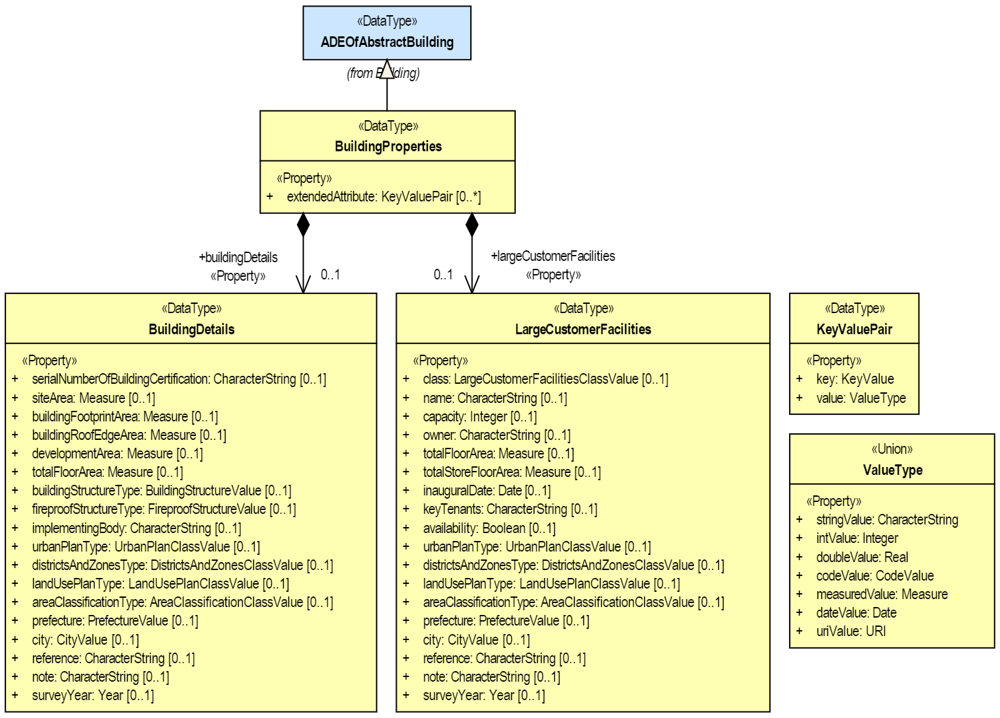
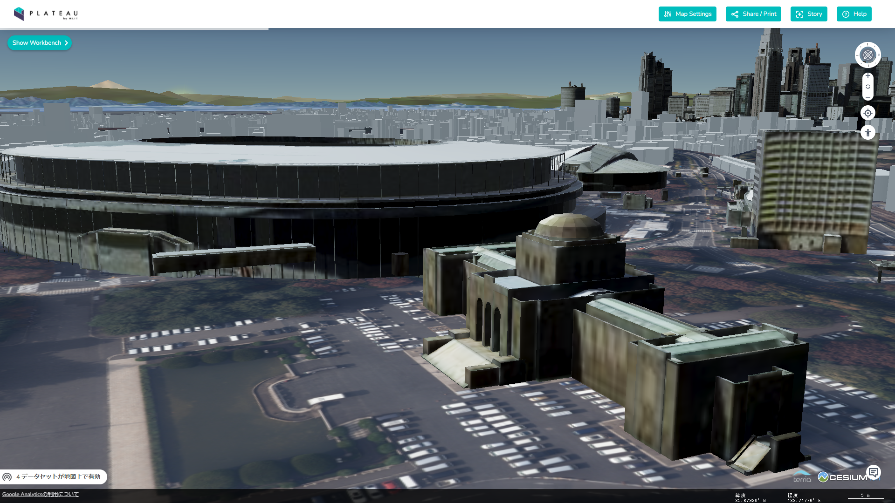

[[annex-examples-ade]]
=== Application Domain Extension (ADE) Examples

The CityGML 3.0 Conceptual Model introduces the concept of the https://docs.ogc.org/is/20-010/20-010.html#toc66[Application Domain Extension (ADE)] to ensure extensibility of the CityGML data model as in the previous version CityGML 2.0. The ADE mechanism allows to add new application-specific feature types, to inject additional properties to the predefined CityGML feature types, to associate application data with predefined CityGML content, or to define value domains for attributes.

Since CityGML 3.0 applies the Model-Driven Architecture approach which separates the conceptual model and the encoding, the development of ADEs differs from CityGML 2.0. In a first step, ADEs shall be defined as UML conceptual models. Afterwards, XML schemas shall be derived automatically from the UML conceptual models using suitable software tools. This is identical to the creation of the CityGML 3.0 XML schemas which have been derived automatically from the CityGML 3.0 UML Conceptual Model.

This chapter will illustrate the workflow of ADE generation using the example of two ADEs: 1) a so-called Test ADE, which is an artificial ADE that comprises most possible scenarios that can occur in an ADE, and 2) the Urban Planning ADE as real-world example.

For both ADEs, UML models have been created based on the rules described in Chapter 9 of the CityGML 3.0 Conceptual Model standard for how to define UML models for ADEs. The UML models were created using the Enterprise Architect project file that already contains the CityGML 3.0 UML model. Afterwards, the software tool ShapeChange was applied to the UML models to derive the XML schemas. Finally, test data sets were implemented that validate against the XML schemas.

==== Example 1: Test ADE

The Test ADE is a light-weight artificial ADE, which was designed for demonstrating the most frequent scenarios in practical ADEs. In particular,
the both methods ('hook' mechanism and subclassing) for augmenting predefined CityGML feature classes with additional ADE Properties are presented.
The UML Conceptual Model of the Test ADE is shown in <<figure-test-ade-uml>>. All ADE classes can be categorized into the following groups:

. The _BuildingUndergroundClassValue_, _BuildingUndergroundFunctionValue_, and _BuildingUndergroundUsageValue_ show how to define ADE class attributes using code list.
. The _EnergyPerformanceCertification_ is an example of how to define an ADE data type, which can comprise a set of simple attributes.
. The _BuildingProperties_ is a subclass of the 'hook' data type _ADEOfAbstractBuilding_ for augmenting the predefined CityGML class _AbstractBuilding_ with additional properties.
. The _Facility_ and its subclasses _ElectricalAppliance_ and _LightingFacility_ are object types, which are not derived from any predefined CityGML classes.
. The _IndustrialBuilding_ and _MovingConstruction_ are two top-level classes derived from the predefined CityGML top-level classes _Building_ and _OtherConstruction_ respectively.
. The _IndustrialBuildingPart_ and _SolarRoofSurface_ are two example non-top-level classes, which are also derived from the CityGML thematic modules _Building_ and _Construction_.
. The _AbstractBuildingUnderground_ and its subclasses _BuildingUnderground_ and _BuildingUndergroundPart_ are derived from the CityGML Core Module, and comprise a couple of new thematic and spatial properties in addition to the superclass _AbstractOccupiedSpace_.

A corresponding XML schema derived from the UML Conceptual Model is shown in <<listing-test-ade-xml-schema>>. An example ADE dataset is represented in <<listing-test-ade-example-dataset>>.

[[figure-test-ade-uml]]
.UML model of the Test ADE.
image::images/TestADE_UML.png[align="center"]

[[listing-test-ade-xml-schema]]
.XML schema of the Test ADE model in <<figure-test-ade-uml>>.
[source,XML]
----
<?xml version="1.0" encoding="UTF-8"?><schema xmlns="http://www.w3.org/2001/XMLSchema" xmlns:bldg="http://www.opengis.net/citygml/building/3.0" xmlns:con="http://www.opengis.net/citygml/construction/3.0" xmlns:core="http://www.opengis.net/citygml/3.0" xmlns:gml="http://www.opengis.net/gml/3.2" xmlns:test="http://www.citygml.org/ade/TestADE/2.0" elementFormDefault="qualified" targetNamespace="http://www.citygml.org/ade/TestADE/2.0" version="2.0">
  <import namespace="http://www.opengis.net/citygml/3.0" schemaLocation="../schema/core.xsd"/>
  <import namespace="http://www.opengis.net/citygml/building/3.0" schemaLocation="../schema/building.xsd"/>
  <import namespace="http://www.opengis.net/citygml/construction/3.0" schemaLocation="../schema/construction.xsd"/>
  <import namespace="http://www.opengis.net/gml/3.2" schemaLocation="http://schemas.opengis.net/gml/3.2.1/gml.xsd"/>
  <!--XML Schema document created by ShapeChange - http://shapechange.net/-->
  <element abstract="true" name="AbstractBuildingUnderground" substitutionGroup="core:AbstractOccupiedSpace" type="test:AbstractBuildingUndergroundType"/>
  <complexType abstract="true" name="AbstractBuildingUndergroundType">
    <complexContent>
      <extension base="core:AbstractOccupiedSpaceType">
        <sequence>
          <element minOccurs="0" name="class" type="gml:CodeType"/>
          <element maxOccurs="unbounded" minOccurs="0" name="usage" type="gml:CodeType"/>
          <element maxOccurs="unbounded" minOccurs="0" name="energyPerformanceCertification" type="test:EnergyPerformanceCertificationPropertyType"/>
          <element minOccurs="0" name="lod0GenericGeometry" type="gml:GeometryPropertyType"/>
          <element maxOccurs="unbounded" minOccurs="0" name="address" type="core:AddressPropertyType"/>
          <element maxOccurs="unbounded" minOccurs="0" name="equippedWith">
            <complexType>
              <complexContent>
                <extension base="gml:AbstractMemberType">
                  <sequence minOccurs="0">
                    <element ref="test:Facility"/>
                  </sequence>
                  <attributeGroup ref="gml:AssociationAttributeGroup"/>
                </extension>
              </complexContent>
            </complexType>
          </element>
          <element maxOccurs="unbounded" minOccurs="0" name="function" type="gml:CodeType"/>
        </sequence>
      </extension>
    </complexContent>
  </complexType>
  <complexType name="AbstractBuildingUndergroundPropertyType">
    <sequence minOccurs="0">
      <element ref="test:AbstractBuildingUnderground"/>
    </sequence>
    <attributeGroup ref="gml:AssociationAttributeGroup"/>
    <attributeGroup ref="gml:OwnershipAttributeGroup"/>
  </complexType>
  <element name="BuildingProperties" substitutionGroup="bldg:ADEOfAbstractBuilding" type="test:BuildingPropertiesType"/>
  <complexType name="BuildingPropertiesType">
    <complexContent>
      <extension base="bldg:ADEOfAbstractBuildingType">
        <sequence>
          <element minOccurs="0" name="ownerName" type="string"/>
          <element name="energyPerformanceCertification" type="test:EnergyPerformanceCertificationPropertyType"/>
          <element maxOccurs="unbounded" minOccurs="0" name="buildingUnderground">
            <complexType>
              <complexContent>
                <extension base="gml:AbstractFeatureMemberType">
                  <sequence minOccurs="0">
                    <element ref="test:BuildingUnderground"/>
                  </sequence>
                  <attributeGroup ref="gml:AssociationAttributeGroup"/>
                </extension>
              </complexContent>
            </complexType>
          </element>
          <element minOccurs="0" name="floorArea" type="gml:AreaType"/>
        </sequence>
      </extension>
    </complexContent>
  </complexType>
  <complexType name="BuildingPropertiesPropertyType">
    <sequence>
      <element ref="test:BuildingProperties"/>
    </sequence>
  </complexType>
  <element name="BuildingUnderground" substitutionGroup="test:AbstractBuildingUnderground" type="test:BuildingUndergroundType"/>
  <complexType name="BuildingUndergroundType">
    <complexContent>
      <extension base="test:AbstractBuildingUndergroundType">
        <sequence>
          <element maxOccurs="unbounded" minOccurs="0" name="consistsOf">
            <complexType>
              <complexContent>
                <extension base="gml:AbstractFeatureMemberType">
                  <sequence minOccurs="0">
                    <element ref="test:BuildingUndergroundPart"/>
                  </sequence>
                  <attributeGroup ref="gml:AssociationAttributeGroup"/>
                </extension>
              </complexContent>
            </complexType>
          </element>
        </sequence>
      </extension>
    </complexContent>
  </complexType>
  <complexType name="BuildingUndergroundPropertyType">
    <sequence minOccurs="0">
      <element ref="test:BuildingUnderground"/>
    </sequence>
    <attributeGroup ref="gml:AssociationAttributeGroup"/>
    <attributeGroup ref="gml:OwnershipAttributeGroup"/>
  </complexType>
  <element name="BuildingUndergroundPart" substitutionGroup="test:AbstractBuildingUnderground" type="test:BuildingUndergroundPartType"/>
  <complexType name="BuildingUndergroundPartType">
    <complexContent>
      <extension base="test:AbstractBuildingUndergroundType">
        <sequence/>
      </extension>
    </complexContent>
  </complexType>
  <complexType name="BuildingUndergroundPartPropertyType">
    <sequence minOccurs="0">
      <element ref="test:BuildingUndergroundPart"/>
    </sequence>
    <attributeGroup ref="gml:AssociationAttributeGroup"/>
    <attributeGroup ref="gml:OwnershipAttributeGroup"/>
  </complexType>
  <element name="ElectricalAppliance" substitutionGroup="test:Facility" type="test:ElectricalApplianceType"/>
  <complexType name="ElectricalApplianceType">
    <complexContent>
      <extension base="test:FacilityType">
        <sequence/>
      </extension>
    </complexContent>
  </complexType>
  <complexType name="ElectricalAppliancePropertyType">
    <sequence minOccurs="0">
      <element ref="test:ElectricalAppliance"/>
    </sequence>
    <attributeGroup ref="gml:AssociationAttributeGroup"/>
    <attributeGroup ref="gml:OwnershipAttributeGroup"/>
  </complexType>
  <element name="EnergyPerformanceCertification" substitutionGroup="gml:AbstractObject" type="test:EnergyPerformanceCertificationType"/>
  <complexType name="EnergyPerformanceCertificationType">
    <sequence>
      <element maxOccurs="unbounded" name="certificationName" type="string"/>
      <element name="certificationId" type="string"/>
    </sequence>
  </complexType>
  <complexType name="EnergyPerformanceCertificationPropertyType">
    <sequence>
      <element ref="test:EnergyPerformanceCertification"/>
    </sequence>
  </complexType>
  <element name="Facility" substitutionGroup="gml:AbstractGML" type="test:FacilityType"/>
  <complexType name="FacilityType">
    <complexContent>
      <extension base="gml:AbstractGMLType">
        <sequence>
          <element name="electricalPower" type="gml:MeasureType"/>
        </sequence>
      </extension>
    </complexContent>
  </complexType>
  <complexType name="FacilityPropertyType">
    <sequence minOccurs="0">
      <element ref="test:Facility"/>
    </sequence>
    <attributeGroup ref="gml:AssociationAttributeGroup"/>
    <attributeGroup ref="gml:OwnershipAttributeGroup"/>
  </complexType>
  <element name="IndustrialBuilding" substitutionGroup="bldg:Building" type="test:IndustrialBuildingType"/>
  <complexType name="IndustrialBuildingType">
    <complexContent>
      <extension base="bldg:BuildingType">
        <sequence>
          <element minOccurs="0" name="remark" type="string"/>
        </sequence>
      </extension>
    </complexContent>
  </complexType>
  <complexType name="IndustrialBuildingPropertyType">
    <sequence minOccurs="0">
      <element ref="test:IndustrialBuilding"/>
    </sequence>
    <attributeGroup ref="gml:AssociationAttributeGroup"/>
    <attributeGroup ref="gml:OwnershipAttributeGroup"/>
  </complexType>
  <element name="IndustrialBuildingPart" substitutionGroup="bldg:BuildingPart" type="test:IndustrialBuildingPartType"/>
  <complexType name="IndustrialBuildingPartType">
    <complexContent>
      <extension base="bldg:BuildingPartType">
        <sequence>
          <element minOccurs="0" name="remark" type="string"/>
        </sequence>
      </extension>
    </complexContent>
  </complexType>
  <complexType name="IndustrialBuildingPartPropertyType">
    <sequence minOccurs="0">
      <element ref="test:IndustrialBuildingPart"/>
    </sequence>
    <attributeGroup ref="gml:AssociationAttributeGroup"/>
    <attributeGroup ref="gml:OwnershipAttributeGroup"/>
  </complexType>
  <element name="LightingFacility" substitutionGroup="test:Facility" type="test:LightingFacilityType"/>
  <complexType name="LightingFacilityType">
    <complexContent>
      <extension base="test:FacilityType">
        <sequence/>
      </extension>
    </complexContent>
  </complexType>
  <complexType name="LightingFacilityPropertyType">
    <sequence minOccurs="0">
      <element ref="test:LightingFacility"/>
    </sequence>
    <attributeGroup ref="gml:AssociationAttributeGroup"/>
    <attributeGroup ref="gml:OwnershipAttributeGroup"/>
  </complexType>
  <element name="MovingConstruction" substitutionGroup="con:OtherConstruction" type="test:MovingConstructionType"/>
  <complexType name="MovingConstructionType">
    <complexContent>
      <extension base="con:OtherConstructionType">
        <sequence>
          <element minOccurs="0" name="remark" type="string"/>
          <element maxOccurs="unbounded" minOccurs="0" name="coveredBy">
            <complexType>
              <complexContent>
                <extension base="gml:AbstractFeatureMemberType">
                  <sequence minOccurs="0">
                    <element ref="test:SolarRoofSurface"/>
                  </sequence>
                  <attributeGroup ref="gml:AssociationAttributeGroup"/>
                </extension>
              </complexContent>
            </complexType>
          </element>
        </sequence>
      </extension>
    </complexContent>
  </complexType>
  <complexType name="MovingConstructionPropertyType">
    <sequence minOccurs="0">
      <element ref="test:MovingConstruction"/>
    </sequence>
    <attributeGroup ref="gml:AssociationAttributeGroup"/>
    <attributeGroup ref="gml:OwnershipAttributeGroup"/>
  </complexType>
  <element name="SolarRoofSurface" substitutionGroup="con:RoofSurface" type="test:SolarRoofSurfaceType"/>
  <complexType name="SolarRoofSurfaceType">
    <complexContent>
      <extension base="con:RoofSurfaceType">
        <sequence>
          <element minOccurs="0" name="remark" type="string"/>
        </sequence>
      </extension>
    </complexContent>
  </complexType>
  <complexType name="SolarRoofSurfacePropertyType">
    <sequence minOccurs="0">
      <element ref="test:SolarRoofSurface"/>
    </sequence>
    <attributeGroup ref="gml:AssociationAttributeGroup"/>
    <attributeGroup ref="gml:OwnershipAttributeGroup"/>
  </complexType>
</schema>
----

[[listing-test-ade-example-dataset]]
.Example dataset implementing the illustrated Test ADE schema.
[source,XML]
----
<?xml version="1.0" encoding="UTF-8" standalone="yes"?>
<CityModel xmlns:con="http://www.opengis.net/citygml/construction/3.0" xmlns:tran="http://www.opengis.net/citygml/transportation/3.0" xmlns:wtr="http://www.opengis.net/citygml/waterbody/3.0" xmlns:veg="http://www.opengis.net/citygml/vegetation/3.0" xmlns="http://www.opengis.net/citygml/3.0" xmlns:dem="http://www.opengis.net/citygml/relief/3.0" xmlns:gml="http://www.opengis.net/gml/3.2" xmlns:bldg="http://www.opengis.net/citygml/building/3.0" xmlns:ct="urn:oasis:names:tc:ciq:ct:3" xmlns:grp="http://www.opengis.net/citygml/cityobjectgroup/3.0" xmlns:dyn="http://www.opengis.net/citygml/dynamizer/3.0" xmlns:pnt="http://www.opengis.net/citygml/pointcloud/3.0" xmlns:tun="http://www.opengis.net/citygml/tunnel/3.0" xmlns:frn="http://www.opengis.net/citygml/cityfurniture/3.0" xmlns:gen="http://www.opengis.net/citygml/generics/3.0" xmlns:xAL="urn:oasis:names:tc:ciq:xal:3" xmlns:app="http://www.opengis.net/citygml/appearance/3.0" xmlns:luse="http://www.opengis.net/citygml/landuse/3.0" xmlns:brid="http://www.opengis.net/citygml/bridge/3.0" xmlns:ver="http://www.opengis.net/citygml/versioning/3.0" xmlns:xlink="http://www.w3.org/1999/xlink" xmlns:test="http://www.citygml.org/ade/TestADE/2.0">
  <cityObjectMember>
    <test:IndustrialBuilding>
      <gml:description>FZK/IAI test cases only</gml:description>
      <gml:name>Testcase-0-0_LoD2</gml:name>
      <bldg:class>1100</bldg:class>
      <bldg:roofType>1030</bldg:roofType>
      <bldg:storeysAboveGround>5</bldg:storeysAboveGround>
      <bldg:storeysBelowGround>0</bldg:storeysBelowGround>
      <bldg:storeyHeightsAboveGround uom="#m">2.0</bldg:storeyHeightsAboveGround>
      <bldg:storeyHeightsBelowGround uom="#m">0.0</bldg:storeyHeightsBelowGround>
      <bldg:adeOfAbstractBuilding>
        <test:BuildingProperties>
          <test:ownerName>Smith</test:ownerName>
          <test:energyPerformanceCertification>
            <test:EnergyPerformanceCertification>
              <test:certificationName>certName</test:certificationName>
              <test:certificationId>certId</test:certificationId>
            </test:EnergyPerformanceCertification>
          </test:energyPerformanceCertification>
          <test:buildingUnderground>
            <test:BuildingUnderground>
              <test:lod0GenericGeometry>
                <gml:Polygon>
                  <gml:exterior>
                    <gml:LinearRing>
                      <gml:posList srsDimension="3">6.0 0.0 0.0 0.0 0.0 0.0 0.0 8.0 0.0 6.0 8.0 0.0 6.0 0.0 0.0</gml:posList>
                    </gml:LinearRing>
                  </gml:exterior>
                </gml:Polygon>
              </test:lod0GenericGeometry>
              <test:equippedWith>
                <test:LightingFacility>
                  <test:electricalPower uom="W">4000.0</test:electricalPower>
                </test:LightingFacility>
              </test:equippedWith>
            </test:BuildingUnderground>
          </test:buildingUnderground>
        </test:BuildingProperties>
      </bldg:adeOfAbstractBuilding>
      <test:remark>remark</test:remark>
    </test:IndustrialBuilding>
  </cityObjectMember>
</CityModel>
----
==== Example 2: Urban Planning ADE

In this example, ADE generation and data implementation of the Urban Planning ADE for CityGML 3.0 are explained. This is based on actual ADE schemas and data of the Urban Planning ADE with exist already for CityGML 2.0 and are published as Open Standard https://www.chisou.go.jp/tiiki/toshisaisei/itoshisaisei/iur/["Data Encoding Specification of i-Urban Revitalization -Urban Planning ADE-"] and Open Data from https://www.mlit.go.jp/plateau/opendata/[the Project PLATEAU] in Japan.

The Urban Planning ADE has been published to realize "i-Urban Revitalization", an information infrastructure dedicated for urban planning to contribute to data-driven urban development and urban revitalization. In the Urban Planning ADE, four modules are defined: Urban Object, Urban Function, Statistical Grid Module, and Public Transit. See https://portal.ogc.org/files/?artifact_id=92113[OGC Discussion Paper (OGC 20-000r1)] and https://doi.org/10.5194/isprs-annals-V-4-2020-179-2020[ISPRS annals] for more information about the Urban Planning ADE.

*Step 1: Designing the ADE as UML conceptual model*

This example shows how to convert the Urban Object (namespace: uro) module from CityGML 2.0 to CityGML 3.0 and how to inject additional properties to the predefined CityGML _Building_ feature type. In order to allow to use multiple distinct ADEs for the same CityGML feature type, the CityGML 3.0 specification recommends to inject additional properties to a predefined feature type by a mechanism called "hook" rather than defining a subclass that inherits from a predefined CityGML feature type.

The hook has been implemented in the the CityGML 3.0 Conceptual Model as data type _ADEOf<FeatureTypeName>_ defined for each feature type where _<FeatureTypeName>_ is the name of that feature type.
The UML models for the Urban Object module has been implemented as described in the Requirement 50 in  https://docs.ogc.org/is/20-010/20-010.html#toc71[section 9.5 in CityGML 3.0 Conceptual Model]. The UML model has been defined using the software tool https://sparxsystems.com/[Enterprise Architect] and is available link:Examples/ADE-examples/Urban-Planning-ADE/CityGML_3.0_UrbanPlanningADE.eap[here] as .eap file.

The UML conceptual model is illustrated in <<figure-ADE-realworld-uml1>>.
The DataType _BuildingProperties_ is modelled as subclass of the "hook" data type _ADEOfAbstractBuilding_ and defines the additional properties that are added to the CityGML _AbstractBuilding_ class. Additionally, a DataType _KeyValuePair_ and a Union _ValueType_ are defined. By using the _BuildingProperties_ that includes two sets of properties, _BuildingDetails_ and _LargeCustomerFacilities_, 3D city models can systematically be extended with the detailed properties for urban planning.

[[figure-ADE-realworld-uml1]]
.UML model of the Urban Object module from the Urban Planning ADE.

*Step 2: Deriving the XML schema from the UML model*

After the UML model has been defined, an XML schema can be derived from the UML model automatically using https://shapechange.net/[ShapeChange]. To be able to do so, first a configuration file needs to be developed which ShapeChange needs for executing the conversion in a correct way.

The command below shows how to convert the UML model to an XML schema by running ShapeChange via a command shell
....
java -jar ShapeChange-2.11.0.jar -Dfile.encoding=UTF-8 -c ShapeChangeConfigurationFile_CityGML_3.0_UrbanPlanningADE.xml
....

link:Examples/ADE-examples/Urban-Planning-ADE/ShapeChangeConfigurationFile_CityGML_3.0_UrbanPlanningADE.xml[The ShapeChange configuration file] is illustrated in <<listing-ADE-realworld-shapechange1>> and link:Examples/ADE-examples/Urban-Planning-ADE/urbanObject_CityGML3.xsd[the derived XML schema] from https://github.com/nob140/CityGML3_ADE/blob/main/AutomaticConversion/UML/CityGML_3.0_UrbanPlanningADE.eap[the Enterprise Architect UML model] is illustrated in <<listing-ADE-realworld-ADE1>>.

[[listing-ADE-realworld-shapechange1]]
.ShapeChange configuration file used for converting the ADE UML model to an XML schema.
[source,XML]
----
<?xml version="1.0" encoding="UTF-8"?>
<ShapeChangeConfiguration xmlns:xi="http://www.w3.org/2001/XInclude" 
    xmlns="http://www.interactive-instruments.de/ShapeChange/Configuration/1.1" 
    xmlns:sc="http://www.interactive-instruments.de/ShapeChange/Configuration/1.1"  
    xmlns:xsi="http://www.w3.org/2001/XMLSchema-instance" 
    xsi:schemaLocation="http://www.interactive-instruments.de/ShapeChange/Configuration/1.1 http://shapechange.net/resources/schema/ShapeChangeConfiguration.xsd">
    
  <input>
    <parameter name="inputModelType" value="EA7"/>
    <parameter name="inputFile" value="CityGML_3.0_UrbanPlanningADE.eap"/>
    <parameter name="appSchemaName" value="UrbanObjectData"/>
    <parameter name="checkingConstraints" value="disabled"/>
    <parameter name="addTaggedValues" value="itemType"/>
    <xi:include href="http://shapechange.net/resources/config/StandardAliases.xml"/>
    <stereotypeAliases>
      <StereotypeAlias wellknown="property" alias="Property"/>
      <StereotypeAlias wellknown="version" alias="Version"/>
      <StereotypeAlias wellknown="FeatureType" alias="TopLevelFeatureType"/>
    </stereotypeAliases>
  </input>
  
  <log>
    <parameter name="reportLevel" value="INFO"/>
    <parameter name="logFile" value="Log_CityGML_3.0_UrbanPlanningADE.xml"/>
  </log>
  
  <targets>
    <TargetXmlSchema class="de.interactive_instruments.ShapeChange.Target.XmlSchema.XmlSchema" mode="enabled">
      <targetParameter name="outputDirectory" value="./"/>
      <targetParameter name="defaultEncodingRule" value="citygml"/>
      <rules>
        <EncodingRule name="citygml" extends="iso19136_2007">
          <rule name="rule-xsd-rel-association-classes"/>
          <rule name="rule-xsd-cls-basictype"/>
          <rule name="rule-xsd-prop-initialValue"/>
          <rule name="rule-xsd-prop-att-map-entry"/>
          <rule name="rule-xsd-prop-constrainingFacets"/>
          <rule name="rule-xsd-all-notEncoded"/>
          <rule name="rule-xsd-cls-union-asGroup"/>
        </EncodingRule>
      </rules>
      <xi:include href="http://shapechange.net/resources/config/StandardRules.xml"/>
      <xi:include href="http://shapechange.net/resources/config/StandardNamespaces.xml"/>
      <xmlNamespaces>
       <XmlNamespace nsabr="app" ns="http://www.opengis.net/citygml/appearance/3.0" location="../schema/appearance.xsd"/>
       <XmlNamespace nsabr="brid" ns="http://www.opengis.net/citygml/bridge/3.0" location="../schema/bridge.xsd"/>
       <XmlNamespace nsabr="bldg" ns="http://www.opengis.net/citygml/building/3.0" location="../schema/building.xsd"/>
       <XmlNamespace nsabr="pcl" ns="http://www.opengis.net/citygml/pointcloud/3.0" location="../schema/pointCloud.xsd"/>
       <XmlNamespace nsabr="frn" ns="http://www.opengis.net/citygml/cityfurniture/3.0" location="../schema/cityFurniture.xsd"/>
       <XmlNamespace nsabr="grp" ns="http://www.opengis.net/citygml/cityobjectgroup/3.0" location="../schema/cityObjectGroup.xsd"/>
       <XmlNamespace nsabr="con" ns="http://www.opengis.net/citygml/construction/3.0" location="../schema/construction.xsd"/>
       <XmlNamespace nsabr="core" ns="http://www.opengis.net/citygml/3.0" location="../schema/core.xsd"/>
       <XmlNamespace nsabr="dyn" ns="http://www.opengis.net/citygml/dynamizer/3.0" location="../schema/dynamizer.xsd"/>
       <XmlNamespace nsabr="gen" ns="http://www.opengis.net/citygml/generics/3.0" location="../schema/generics.xsd"/>
       <XmlNamespace nsabr="luse" ns="http://www.opengis.net/citygml/landuse/3.0" location="../schema/landUse.xsd"/>
       <XmlNamespace nsabr="dem" ns="http://www.opengis.net/citygml/relief/3.0" location="../schema/relief.xsd"/>
       <XmlNamespace nsabr="tran" ns="http://www.opengis.net/citygml/transportation/3.0" location="../schema/transportation.xsd"/>
       <XmlNamespace nsabr="tun" ns="http://www.opengis.net/citygml/tunnel/3.0" location="../schema/tunnel.xsd"/>
       <XmlNamespace nsabr="veg" ns="http://www.opengis.net/citygml/vegetation/3.0" location="../schema/vegetation.xsd"/>
       <XmlNamespace nsabr="vers" ns="http://www.opengis.net/citygml/versioning/3.0" location="../schema/versioning.xsd"/>
       <XmlNamespace nsabr="wtr" ns="http://www.opengis.net/citygml/waterbody/3.0" location="../schema/waterBody.xsd"/>
       <XmlNamespace nsabr="xAL" ns="urn:oasis:names:tc:ciq:xal:3" location="http://docs.oasis-open.org/ciq/v3.0/cs02/xsd/default/xsd/xAL.xsd"/> 
      </xmlNamespaces>
      <xi:include href="http://shapechange.net/resources/config/StandardMapEntries.xml"/>
      <xsdMapEntries>
        <XsdMapEntry type="URI" xsdEncodingRules="iso19136_2007 gml33" xmlPropertyType="anyURI" xmlType="anyURI" xmlTypeType="simple" xmlTypeContent="simple"/>
      </xsdMapEntries>
    </TargetXmlSchema>
    <Target class="de.interactive_instruments.ShapeChange.Target.Codelists.CodelistDictionaries" mode="disabled">
      <targetParameter name="outputDirectory" value="../codelists"/>
    </Target>
  </targets>
</ShapeChangeConfiguration>
----

[[listing-ADE-realworld-ADE1]]
.XML schema document of the ADE derived from UML model.
[source,XML]
----
<?xml version="1.0" encoding="UTF-8"?><schema xmlns="http://www.w3.org/2001/XMLSchema" xmlns:bldg="http://www.opengis.net/citygml/building/3.0" ...  xmlns:uro="https://www.chisou.go.jp/tiiki/toshisaisei/itoshisaisei/iur/uro/1.5" elementFormDefault="qualified" targetNamespace="https://www.chisou.go.jp/tiiki/toshisaisei/itoshisaisei/iur/uro/1.5" version="1.5">
  <import namespace="http://www.opengis.net/citygml/building/3.0" schemaLocation="../schema/building.xsd"/>
  ...
  <!--XML Schema document created by ShapeChange - http://shapechange.net/-->
  <element name="BuildingDetails" substitutionGroup="gml:AbstractObject" type="uro:BuildingDetailsType"/>
  <complexType name="BuildingDetailsType">
    <sequence>
      <element minOccurs="0" name="serialNumberOfBuildingCertification" type="string"/>
      <element minOccurs="0" name="siteArea" type="gml:MeasureType"/>
      <element minOccurs="0" name="buildingFootprintArea" type="gml:MeasureType"/>
      <element minOccurs="0" name="buildingRoofEdgeArea" type="gml:MeasureType"/>
      <element minOccurs="0" name="developmentArea" type="gml:MeasureType"/>
      <element minOccurs="0" name="totalFloorArea" type="gml:MeasureType"/>
      <element minOccurs="0" name="buildingStructureType" type="gml:CodeType"/>
      <element minOccurs="0" name="fireproofStructureType" type="gml:CodeType"/>
      <element minOccurs="0" name="implementingBody" type="string"/>
      <element minOccurs="0" name="urbanPlanType" type="gml:CodeType"/>
      <element minOccurs="0" name="districtsAndZonesType" type="gml:CodeType"/>
      <element minOccurs="0" name="landUsePlanType" type="gml:CodeType"/>
      <element minOccurs="0" name="areaClassificationType" type="gml:CodeType"/>
      <element minOccurs="0" name="prefecture" type="gml:CodeType"/>
      <element minOccurs="0" name="city" type="gml:CodeType"/>
      <element minOccurs="0" name="reference" type="string"/>
      <element minOccurs="0" name="note" type="string"/>
      <element minOccurs="0" name="surveyYear" type="gYear"/>
    </sequence>
  </complexType>
  <complexType name="BuildingDetailsPropertyType">
    <sequence>
      <element ref="uro:BuildingDetails"/>
    </sequence>
  </complexType>
  <element name="BuildingProperties" substitutionGroup="bldg:ADEOfAbstractBuilding" type="uro:BuildingPropertiesType"/>
  <complexType name="BuildingPropertiesType">
    <complexContent>
      <extension base="bldg:ADEOfAbstractBuildingType">
        <sequence>
          <element minOccurs="0" name="buildingDetails" type="uro:BuildingDetailsPropertyType"/>
          <element minOccurs="0" name="largeCustomerFacilities" type="uro:LargeCustomerFacilitiesPropertyType"/>
          <element maxOccurs="unbounded" minOccurs="0" name="extendedAttribute" type="uro:KeyValuePairPropertyType"/>
        </sequence>
      </extension>
    </complexContent>
  </complexType>
  <complexType name="BuildingPropertiesPropertyType">
    <sequence>
      <element ref="uro:BuildingProperties"/>
    </sequence>
  </complexType>
  <element name="CityObjectGroupProperties" substitutionGroup="grp:ADEOfCityObjectGroup" type="uro:CityObjectGroupPropertiesType"/>
  <complexType name="CityObjectGroupPropertiesType">
    <complexContent>
      <extension base="grp:ADEOfCityObjectGroupType">
        <sequence>
          <element minOccurs="0" name="fiscalYearOfPublication" type="gYear"/>
          <element minOccurs="0" name="language" type="gml:CodeType"/>
        </sequence>
      </extension>
    </complexContent>
  </complexType>
  <complexType name="CityObjectGroupPropertiesPropertyType">
    <sequence>
      <element ref="uro:CityObjectGroupProperties"/>
    </sequence>
  </complexType>
  <element name="KeyValuePair" substitutionGroup="gml:AbstractObject" type="uro:KeyValuePairType"/>
  <complexType name="KeyValuePairType">
    <sequence>
      <element name="key" type="gml:CodeType"/>
      <group ref="uro:ValueTypeGroup"/>
    </sequence>
  </complexType>
  <complexType name="KeyValuePairPropertyType">
    <sequence>
      <element ref="uro:KeyValuePair"/>
    </sequence>
  </complexType>
  <element name="LandUseProperties" substitutionGroup="luse:ADEOfLandUse" type="uro:LandUsePropertiesType"/>
  <complexType name="LandUsePropertiesType">
    <complexContent>
      <extension base="luse:ADEOfLandUseType">
        <sequence>
          <element minOccurs="0" name="nominalArea" type="gml:MeasureType"/>
          <element minOccurs="0" name="ownerType" type="gml:CodeType"/>
          <element minOccurs="0" name="owner" type="string"/>
          <element minOccurs="0" name="areaInSquareMeter" type="gml:MeasureType"/>
          <element minOccurs="0" name="areaInHa" type="gml:MeasureType"/>
          <element minOccurs="0" name="urbanPlanType" type="gml:CodeType"/>
          <element minOccurs="0" name="districtsAndZonesType" type="gml:CodeType"/>
          <element minOccurs="0" name="landUsePlanType" type="gml:CodeType"/>
          <element minOccurs="0" name="areaClassificationType" type="gml:CodeType"/>
          <element minOccurs="0" name="prefecture" type="gml:CodeType"/>
          <element minOccurs="0" name="city" type="gml:CodeType"/>
          <element minOccurs="0" name="reference" type="string"/>
          <element minOccurs="0" name="note" type="string"/>
          <element minOccurs="0" name="surveyYear" type="gYear"/>
        </sequence>
      </extension>
    </complexContent>
  </complexType>
  <complexType name="LandUsePropertiesPropertyType">
    <sequence>
      <element ref="uro:LandUseProperties"/>
    </sequence>
  </complexType>
  <element name="LargeCustomerFacilities" substitutionGroup="gml:AbstractObject" type="uro:LargeCustomerFacilitiesType"/>
  <complexType name="LargeCustomerFacilitiesType">
    <sequence>
      <element minOccurs="0" name="class" type="gml:CodeType"/>
      <element minOccurs="0" name="name" type="string"/>
      <element minOccurs="0" name="capacity" type="integer"/>
      <element minOccurs="0" name="owner" type="string"/>
      <element minOccurs="0" name="totalFloorArea" type="gml:MeasureType"/>
      <element minOccurs="0" name="totalStoreFloorArea" type="gml:MeasureType"/>
      <element minOccurs="0" name="inauguralDate" type="date"/>
      <element minOccurs="0" name="keyTenants" type="string"/>
      <element minOccurs="0" name="availability" type="boolean"/>
      <element minOccurs="0" name="urbanPlanType" type="gml:CodeType"/>
      <element minOccurs="0" name="districtsAndZonesType" type="gml:CodeType"/>
      <element minOccurs="0" name="landUsePlanType" type="gml:CodeType"/>
      <element minOccurs="0" name="areaClassificationType" type="gml:CodeType"/>
      <element minOccurs="0" name="prefecture" type="gml:CodeType"/>
      <element minOccurs="0" name="city" type="gml:CodeType"/>
      <element minOccurs="0" name="reference" type="string"/>
      <element minOccurs="0" name="note" type="string"/>
      <element minOccurs="0" name="surveyYear" type="gYear"/>
    </sequence>
  </complexType>
  <complexType name="LargeCustomerFacilitiesPropertyType">
    <sequence>
      <element ref="uro:LargeCustomerFacilities"/>
    </sequence>
  </complexType>
  <element name="RoadProperties" substitutionGroup="tran:ADEOfRoad" type="uro:RoadPropertiesType"/>
  <complexType name="RoadPropertiesType">
    <complexContent>
      <extension base="tran:ADEOfRoadType">
        <sequence>
          <element minOccurs="0" name="width" type="gml:LengthType"/>
          <element minOccurs="0" name="widthType" type="gml:CodeType"/>
          <element minOccurs="0" name="trafficVolume" type="uro:TrafficVolumePropertyType"/>
        </sequence>
      </extension>
    </complexContent>
  </complexType>
  <complexType name="RoadPropertiesPropertyType">
    <sequence>
      <element ref="uro:RoadProperties"/>
    </sequence>
  </complexType>
  <element name="TrafficVolume" substitutionGroup="gml:AbstractObject" type="uro:TrafficVolumeType"/>
  <complexType name="TrafficVolumeType">
    <sequence>
      <element minOccurs="0" name="weekday12hourTrafficVolume" type="integer"/>
      <element minOccurs="0" name="weekday24hourTrafficVolume" type="integer"/>
      <element minOccurs="0" name="largeVehicleRate" type="double"/>
      <element minOccurs="0" name="congestionRate" type="double"/>
      <element minOccurs="0" name="averageTravelSpeedInCongestion" type="double"/>
      <element minOccurs="0" name="observationPointName" type="string"/>
      <element minOccurs="0" name="urbanPlanType" type="gml:CodeType"/>
      <element minOccurs="0" name="areaClassificationType" type="gml:CodeType"/>
      <element minOccurs="0" name="prefecture" type="gml:CodeType"/>
      <element minOccurs="0" name="city" type="gml:CodeType"/>
      <element minOccurs="0" name="reference" type="string"/>
      <element minOccurs="0" name="note" type="string"/>
      <element minOccurs="0" name="surveyYear" type="gYear"/>
    </sequence>
  </complexType>
  <complexType name="TrafficVolumePropertyType">
    <sequence>
      <element ref="uro:TrafficVolume"/>
    </sequence>
  </complexType>
  <group name="ValueTypeGroup">
    <choice>
      <element name="stringValue" type="string"/>
      <element name="intValue" type="integer"/>
      <element name="doubleValue" type="double"/>
      <element name="codeValue" type="gml:CodeType"/>
      <element name="measuredValue" type="gml:MeasureType"/>
      <element name="dateValue" type="date"/>
      <element name="uriValue" type="anyURI"/>
    </choice>
  </group>
</schema>
----

*Step 3: CityGML 3.0 building models adopting the converted ADE XML schema*

https://www.mlit.go.jp/plateau/[The Project PLATEAU] was launched by MLIT (Ministry of Land, Infrastructure, Transport and Tourism) Japan in 2020, and developed 3D city models for more than 10 million buildings of 56 cities, over 10,000km^2^ in Japan. The 3D city models were implemented using the Urban Planning ADE and were published as Open Data (CC BY 4.0/ODbL).

<<figure-ADE-realworld-step2>> illustrates sample building data, and the <<listing-ADE-realworld-gml1>> shows an example of link:Examples/ADE-examples/Urban-Planning-ADE/53394517_bldg_6697_op2_CityGML3.gml[the GML instance document] that was converted from CityGML 2.0 building model to CityGML 3.0. Note that this conversion was operated manually by checking the ADE XML schema carefully and validating the instance document against the XML schema afterwards. Though there are converters for converting CityGML 2.0 data to CityGML 3.0 such as https://github.com/citygml4j[citygml4j], data conversion for ADEs is not yet supported by these converters.

[[figure-ADE-realworld-step2]]
.Meiji Memorial Picture Gallery (Mesh ID: 53394517, Building ID: 13104-bldg-53) from https://www.geospatial.jp/ckan/dataset/plateau-tokyo23ku[the Project PLATEAU].

[[listing-ADE-realworld-gml1]]
.Example of a CityGML 3.0 GML instance document based on the converted ADE XML schema.
[source,XML]
----
<?xml version="1.0" encoding="UTF-8"?>
<core:CityModel xmlns:uro="https://www.chisou.go.jp/tiiki/toshisaisei/itoshisaisei/iur/uro/1.5" ...
xsi:schemaLocation="https://www.chisou.go.jp/tiiki/toshisaisei/itoshisaisei/iur/uro/1.5 ./urbanObject_CityGML3.xsd ...">
  <gml:boundedBy> ... </gml:boundedBy>
  <core:cityObjectMember>
    <bldg:Building gml:id="BLD_77ca1a15-3b35-4386-8f86-152ed71c4c64">
      <core:genericAttribute> ... </core:genericAttribute>
      ...
      <core:boundary> ... </core:boundary>
      ...
      <core:lod0MultiSurface> ... </core:lod0MultiSurface>
      <core:lod1Solid> ... </core:lod1Solid>
      <core:lod2Solid> ... </core:lod2Solid>
      <con:height> ... </con:height>
      <bldg:address> ... </bldg:address>
      <bldg:adeOfAbstractBuilding>
        <uro:BuildingProperties>
          <uro:buildingDetails>
            <uro:BuildingDetails>
              <uro:buildingRoofEdgeArea uom="m2">2513.85520</uro:buildingRoofEdgeArea>
              <uro:districtsAndZonesType codeSpace="../codelists/Common_districtsAndZonesType.xml">4</uro:districtsAndZonesType>
              <uro:prefecture codeSpace="../codelists/Common_prefecture.xml">13</uro:prefecture>
              <uro:city codeSpace="../codelists/Common_localPublicAuthorities.xml">13104</uro:city>
              <uro:surveyYear>2016</uro:surveyYear>
            </uro:BuildingDetails>
          </uro:buildingDetails>
          <uro:extendedAttribute>
            <uro:KeyValuePair>
              <uro:key codeSpace="../codelists/extendedAttribute_key.xml">2</uro:key>
              <uro:codeValue codeSpace="../codelists/extendedAttribute_key2.xml">2</uro:codeValue>
            </uro:KeyValuePair>
          </uro:extendedAttribute>
          <uro:extendedAttribute>
            <uro:KeyValuePair>
              <uro:key codeSpace="../codelists/extendedAttribute_key.xml">105</uro:key>
              <uro:codeValue codeSpace="../codelists/extendedAttribute_key105.xml">2</uro:codeValue>
            </uro:KeyValuePair>
          </uro:extendedAttribute>
          <uro:extendedAttribute>
            <uro:KeyValuePair>
              <uro:key codeSpace="../codelists/extendedAttribute_key.xml">106</uro:key>
              <uro:codeValue codeSpace="../codelists/extendedAttribute_key106.xml">20</uro:codeValue>
            </uro:KeyValuePair>
          </uro:extendedAttribute>
        </uro:BuildingProperties>
      </bldg:adeOfAbstractBuilding>
    </bldg:Building>
  </core:cityObjectMember>
  <core:appearanceMember> ... </core:appearanceMember>
</core:CityModel>
----
